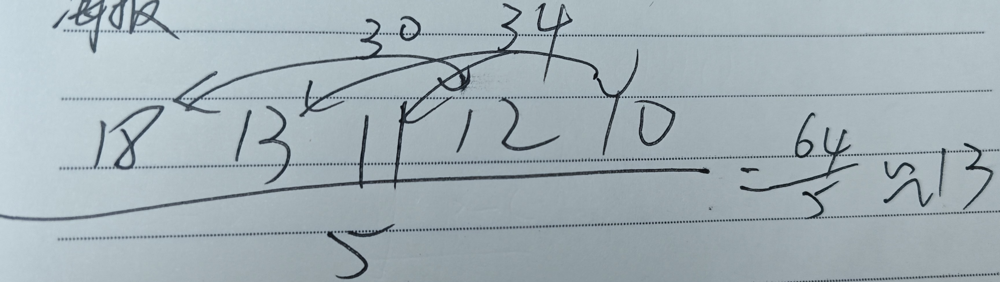

## 不愿意阅读的原因是什么?【按照重要程度判断，五分制】
- **4** 直接读难度高
- **5** 间歇性阅读，时间太长了，读完很累人
- **5** 有工具可以直接用，为什么要自己读呀，偷懒
- **3** 中文部分也有对应的翻译内容
- **2** 英语口语不好，没有实际的用上，科技论文也没有写过
- **0** 熟练使用工具的前提是直到它的运行逻辑是什么，纯黑箱的东西，就得碰运气了

## 核心原因
- 工具依赖
- 没有形成习惯，阅读效率低下
- 到底哪里难？得讲明
  
## 解决方案
- 直接砍掉
- 平均英语科技论文的页数，随机选取五篇取平均值，限定时间范围内阅读完毕

页数确定为13页
时间的话，不知道如何判断，得咨询阅读的多的
- 存在的问题
1. 觉得很多都有用，抓不住重点
2. 检索不是很完全，总是有新的内容，焦头烂额
3. 新的单词，专有单词，分不清楚是自己的单词记忆太少了，还是本身就不需要记忆那么多，信心不足【做一个标记，讲道理不太可能是单词这个原因，如果是这个原因，则分有用和无关，有用的记忆60%】
4. 没有记忆点，看完就忘记了，做笔记？
5. 阅读前，想要获得什么？阅读后，满足阅读前要求吗？又学到了什么？！

## 操作
- [x] 词典类、截图翻译类
- [] 13/
- [] 详读、略读相结合 
