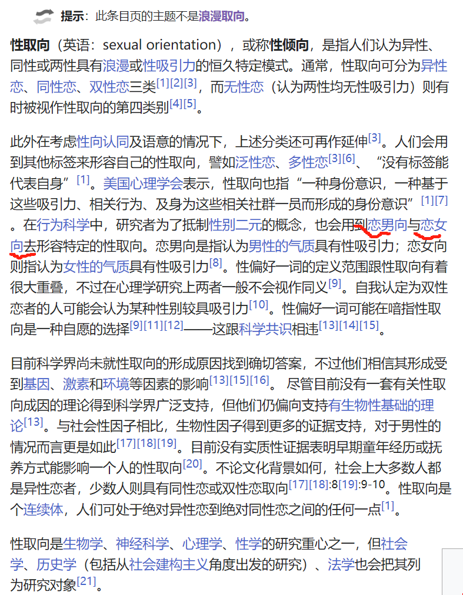

## 双性浪漫异性恋

## 双性浪漫同性恋

## 浪漫取向和性取向
### 浪漫取向

对于浪漫取向理解是一种柏拉图式的爱恋（性不是主要目的，起初是男同的意思，后面引申为一种精神之爱）

区分的话，坦白讲，对于纯男性而言，产生过仰慕的心理，对我好，是不是有什么其他企图。生出一种提防，这个人不会是男同吧，所以应该不算是双性浪漫倾向

除了女生之外，对于具备女性化特征的人也会有好感，觉得建立浪漫关系的话，给性别关系不是特别大的关系，性别的区别在于婚姻阶段，浪漫关系的话，准确说，非男性的浪漫倾向，也可能接触比较少，觉得更多的是精神上的认可和包容，还有一种互补，是那种一起去路上玩儿，不会招致他人异样眼光的（虽然总在说“彪悍的人生不需要任何解释”，但还是会在意社会的眼光，除非那种偷情似的，在家里玩儿，那样不太喜欢，喜欢正大光明地，起码不让其他人烦恼吧）

为了方便理解，按照目前的理解做一个区分，归类到“半浪漫倾向”，被伤害后可能会变成“无浪漫倾向”

其实也每个人的选择，对于LGBT我是持包容态度的，每个人认清自己的需求其实蛮重要的，不断试错呗

### 性取向

标签化没啥意义，这种恋男向和恋女向的说法到是很新奇
我个人的话，喜欢女生占据主导地位，喜欢男性的特质，但真的对男生真的没有任何性趣，但也不是一致喜欢被压制的那种感觉，就是有商有量
或者说具备女性化特征的人，或者说独立自主的女性，而不是那种小家碧玉型的

### 厌男
如果说你是对于厌男或者厌女的这种说法 我觉得这个就是有些对立了
对于你说的厌男不太懂是什么意思，我可以说说我的厌女的感觉
就是阶级矛盾的委婉说法，男女对立了，人民内部矛盾强了，阶级矛盾就不尖锐了
男权社会，只是掌权者是男性，尽管享受着性别红利，但这种红利并不是自己争取出来的，而是一种自上而下的恩赐，我讨厌这种莫名其妙
“无知少女”的快速晋升也是如此
我所说的厌女是对于一些社会现象的离奇感到震惊，这里的女是指那些把自己卖个好价钱，然后宣称独立的女性，而这似乎是社会的主流，女生便应当放弃事业吗？不放弃事业就能做得更好吗？甚至我觉得这是一种对于现状不满的发泄，许多家暴和事件我都是那么劝慰自己的“抽刀向更弱者”

### 关于MBTI
起初我是极度讨厌这种标签的事情，觉得没事儿找事儿

后来发现，这就是压缩包，简单省事儿，而且统计数据上，有些人需要远离，就远离，可以规避一定的风险，尤其“肥猫事件”，近期发生的

虽然网上都是声援的声音，但是我总觉得怪怪的，为啥一往情深那么吸引人？为啥人对于无私付出那么渴望？我看了不少评论，说是希望自己能够替代那个人去照顾，到底需要的是什么？是钱吗？

分析女生男生是一种什么性格，有些忘记了，这种性格在我身上也有一些，就是很贪婪，贪念他人的好，我总是常觉得亏欠，上一段恋爱中，女生给我十块钱的东西我都会很开心，即便可能付出一百元，这种比例，后期我觉得渐渐无法忍受，没办法处理结束，就很拧巴。说出来你可能不信，发觉女生出轨的那个瞬间，我的情绪是难以置信→暗喜→伤心，前期真的麻木了，四天不说话，说话就骂你，我反正是受不了，我这人有个优点，就是想不明白的事情，绝不自己想，绝不过夜，扔给别人去处理。hhh 

就是人是会变的，但善良真的很可贵，指望一个不好的人去变好很难，但是好人变化，可能还尚存良知。

刚去检测了一波，这。。。 果然我的废话还是一如既往的多
[MBTI测试网址](https://www.16personalities.com/ch/%E4%BA%BA%E6%A0%BC%E6%B5%8B%E8%AF%95)
结果是INFJ-T

[infj倡导者](https://www.16personalities.com/ch/infj-%E4%BA%BA%E6%A0%BC)
[infp调停者](https://www.16personalities.com/ch/infp-%E4%BA%BA%E6%A0%BC)
[intp逻辑学家](https://www.16personalities.com/ch/intp-%E4%BA%BA%E6%A0%BC)

评判：仅供参考，选择的话，基本上就有“都可以，对，略对，不对”这种倾向选的，可能会偏颇

就这些啦 吃饭去啦